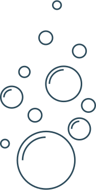

# Design

För projektet så skapade jag ett par skisser med [Figma](https://www.figma.com/), du hittar dem [här](https://www.figma.com/file/tngmvFgOZ96E1xHm9Igr9o/Webbserver-node?node-id=0%3A1). Design är svårt och ett evigt pillande fram och tillbaka mellan olika ställningstaganden. Under processen så märker en ofta också problem med designen, vilket kan vara både estetiska och tekniska. Men i detta arbetet så förbättrar vi produkten stegvis.

Som exempel så letade jag reda på ett färgschema jag gillade först, vilket påminde mig om något under vatten. Jag gillar det, men hur jag använder det på sidan får problem med kontrast. Så jag skruvade lite på hur kontrasterna, men inte så mycket som krävs av de testverktyg jag använder, eftersom jag tyckte jag förlorade känslan. Här gjorde jag en avvägning att behålla min design och inte skrota den på grund av testresultatet. Men det är viktigt att göra detta val tidigt, så att du inte behöver ändra färgerna på hela webbplatsen när du kodat färdigt, för att du aldrig kollade kontrasten. Här underlättar det väldigt mycket också om du använder Sass och tilldelar färgerna till variabler. Du kan dessutom använda Sass [funktioner](https://sass-lang.com/documentation/modules/color) för att manipulera färgerna.

Just tanken om något under vatten ledde till bilden med bubblorna, något som jag skapade i Adobe Illustrator och sparade som SVG. Jag letade upp ett par ikoner och NTI logotypen, sparade dessa som SVG och la till. 

När jag arbetade med den mycket långa titeln, Webbserverprogrammering så fick jag tekniska problem. Det visade sig att ett väldigt långt ord som inte kan avstavas av webbläsaren påverkar hur hela sidan ritas ut när det finns tillsammans med `meta viewport scale`. I det här fallet påverkade det hur resten av sidan ritades ut och resultatet blev hemskt. Lösningen blev att lägga till ett bindestreck mellan Webbserver och programmering, Webbserver-programmering. Inte vad jag kanske önskat, men enklaste och bästa lösningen. Med HTML och CSS så försöker vi få text att se ut som något, vilket inte alltid fungerar som vi tänkt oss. Ibland är det inte ens möjligt, men med testning kan vi åtminstone upptäcka problem som vi på ett eller annat sätt får lösa.

Det här är exempel på avvägningar som behöver göras oavsett om en har skisser att utgå från eller inte. Men att utgå från en skiss och en ide, ger dig ett stöd som alltid underlättar. Att formulera din ide och slipa på den är en del i en process som fortsätts när du kodar din webbsida och att göra det i flera steg leder så gott som alltid till ett bättre slutresultat.

### Från html till webbplats

På det stora hela så handlar det om att stegvis börja skapa sin skiss med hjälp av css stilar. Några viktiga saker att ha i åtanke är att inte försöka designa utan innehåll. Placeringen av element i html är beroende av andra element, så ditt innehåll kommer alltid påverka placeringen. Det andra är att det är väldigt viktigt att strukturen är korrekt och att elementen är korrekt stängda. Annars blir det väldigt svårt med stilarna och det kommer förmodligen resultera i att det inte blir som du önskar. För att göra detta så rekommenderar jag att du [validerar](https://validator.nu/) regelbundet.

Undvik att positionera absolut och tänk alltid på att ändra storleken på din webbläsare, för du kan inte förutsätta att användaren alltid kör samma upplösning som du.

Kom även ihåg att inte fastna i evigheter på detaljer innan du ens har någon design.

